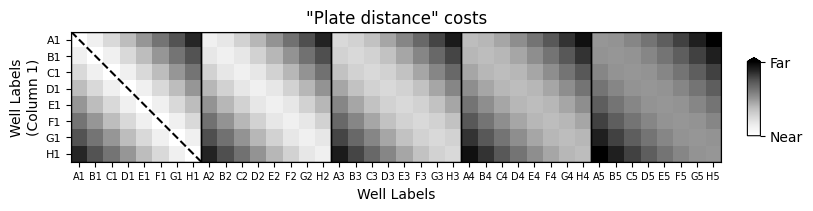
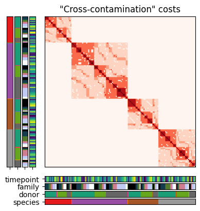

.. image:: https://img.shields.io/badge/-PyScaffold-005CA0?logo=pyscaffold
    :alt: Project generated with PyScaffold
    :target: https://pyscaffold.org/

|

=======================
library-prep-plate-prep
=======================

    Find optimal plate arrangements.

Find optimal arrangements for sequencing samples on a plate during library prep.

Installation
============

.. code-block:: bash

    git clone https://github.com/t-silvers/library-prep-plate-prep.git
    cd library-prep-plate-prep
    pip install -e .

    # or

    pip install git+https://github.com/t-silvers/library-prep-plate-prep.git

Usage
=====

Command line interface
----------------------

.. code-block:: bash

    lppp -i /path/to/samples.csv -o arrangement.csv

Python package
--------------

Finer user control is possible with the Python package.

1. Import sequencing sample data.

.. code-block:: python

    import library_prep_plate_prep as lppp

    num_samples = 150
    sample_data = lppp.simulate_data(num_samples)
    print(sample_data.head(2))
    # species  donor  family  timepoint
    # sample                                                          
    # species 4:B003_0001 @ 03 days        4      1       3          3
    # species 3:B001_0001 @ 14 days        3      1       1         14

2. Provide initial values for the solvers. Except for the number of empty wells, values must be passed as a per-plate list, where all lists share a length equaling the total number of plates.

.. code-block:: python

    plate_init = {
        'n_controls': [3, 2],
        'n_columns': [10, 10],
        'n_rows': [8, 8],
        'n_empty': 2,
    }

Alternatively, let library-prep-plate-prep calculate reasonable defaults.

.. code-block:: python

    plate_init = lppp.utils.calc_init_vals(sample_data.shape[0])

3. Plate arrangement problems accept a plate geometry object and sample geometry object. These geometry objects have an associated cost function, calculated over observed values in the associated metric space.

.. code-block:: python

    plates = lppp.geometries.Plates(
        plate_init['n_columns'],
        plate_init['n_rows'],
        cost_fn=lppp.costs.SqEuclidean()
    )
    
    samples = lppp.geometries.SequencingSamples.from_samples(
        sample_data,
        plate_init['n_empty'],
        sum(plate_init['n_controls']),
        cost_fn=lppp.costs.CovarSimilarity()
    )

Custom cost functions can be used, either by subclassing Python cost function classes or using convenience class methods.

.. code-block:: python

    custom_sample_cost_fn = lppp.costs.CovarSimilarity.from_rules(
        {
            'species': 10,
            'species_&_family': 0,
            'species_&_donor': 0,
            'species_&_family_&_timepoint': 0,
            'species_&_donor_&_family': 0,
            'species_&_donor_&_family_&_timepoint': 0,
        }
    )

    samples = lppp.geometries.SequencingSamples.from_samples(
        sample_data,
        plate_init['n_empty'],
        sum(plate_init['n_controls']),
        cost_fn=custom_sample_cost_fn
    )

4. Initialize the plate arrangement problem.

.. code-block:: python

    prob = lppp.problems.ArrangementProblem(plates, samples)

5. Set up the seeded arrangement problem by first allocating control wells using a space-filling design method (here, Latin Hypercube Sampling).

.. code-block:: python

    ctrls_seeder = lppp.solvers.LHSampler()
    ctrls_arrangement = ctrls_seeder(prob, nt=plate_init['n_controls'])

6. Select a solver and solve the plate arrangement problem.

.. code-block:: python

    solver = lppp.solvers.QAP_2opt()
    soln = solver(prob, partial_match=ctrls_arrangement)

    plate_arrangement = lppp.problems.soln_to_df(prob, soln)
    print(plate_arrangement.head(1))
    # plate  column row well
    # sample                                               
    # species 1:B002_0002 @ 03 days      0       1   A   A1

library-prep-plate-prep provides tools for visualizing the problem set-up and solution space.

.. code-block:: python

    import matplotlib.pyplot as plt

    fig, ax = plt.subplots(figsize=(9, 2), layout='constrained')
    lppp.plotting.plate_costs(plates, ncols=5, fig=fig, ax=ax)

.. code-block:: python

    import matplotlib.pyplot as plt

    fig, ax = plt.subplots(figsize=(4, 4), layout='constrained')
    lppp.plotting.sample_costs(samples, ax=ax)

References
==========

- 2016 Mathematical modeling. 4.3.4 The Transportation Problem
- 2015 Princeton companion mathematics. VI.18 The Traveling Salesman Problem. William Cook
- 2023 Design Heuristics 2.5.4 Quadratic Assignment, 9 Local Search Learning, 9.2 Strategic Oscillations, code listing 9.1

.. _pyscaffold-notes:

Note
====

This project has been set up using PyScaffold 4.5. For details and usage
information on PyScaffold see https://pyscaffold.org/.
